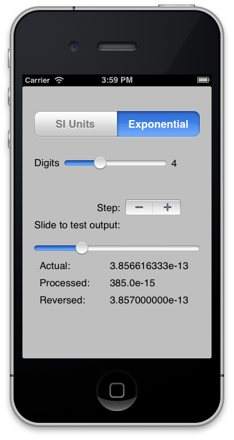

EngineeringNotationFormatter
============================

iOS Project demoing C-based Engineering Notation Formatter with a Objective-C wrapper.

Several years ago I tripped on a great C function that formats a floating point number into engineering notation, in either exponential or International System of Units (SI) notation. This C code was written by Jukka Korpela and posted at http://www.cs.tut.fi/~jkorpela/c/eng.html.

This function is useful when you want to display say, length, in units people (not machines) can understand. Thus, instead of "1.67e4 meters" you could show either "16.7e3 meters", or using the SI prefixes (http://physics.nist.gov/cuu/Units/prefixes.html) as "17.7 k meters".

As Jukka points out, there is no POSIX (i.e. printf) formatter that will do this, so he wrote one. In using his code, I found an edge condition and provided updated code, which Jukka appended to his web page circa 2009.

The code has a most interesting feature; the ability to specify the number of significant digits. For instance, if you set the value to 4, every number will be rounded up or down so that it is comprises exactly that many digits. Thus, you can utilize this code to provide a floating point step function, that exactly steps a number by one increment (or decrement) to its lowest significant digit. There are convenience functions in both C and Objective-C to perform this step.

A reverse function is also provided that takes the string in either exponential or SI units and returns the floating point number properly rounded.

For sure, this feature is not one many people need, but it you do need it, this code is invaluable, and I'm sure Jukka spent a good deal of time working on it.

The included iOS project can be used to experiment with the various settings:

We jointly offer this code here with a unattributed BSD style license (see source files).
